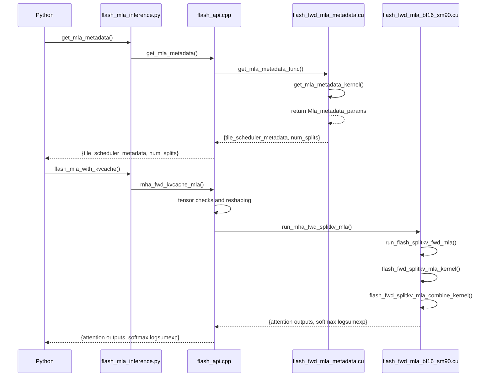

# FlashMLA

## code
```sh
├── csrc
│   ├── cutlass
│   ├── flash_api.cpp
│   ├── flash_fwd_mla_bf16_sm90.cu
│   ├── flash_fwd_mla_fp16_sm90.cu
│   ├── flash_fwd_mla_kernel.h
│   ├── flash_fwd_mla_metadata.cu
│   ├── flash_mla.h
│   ├── named_barrier.h
│   ├── softmax.h
│   ├── static_switch.h
│   └── utils.h
├── flash_mla
│   ├── __init__.py
│   └── flash_mla_interface.py
└── tests
    └── test_flash_mla.py
```

## start from python api
